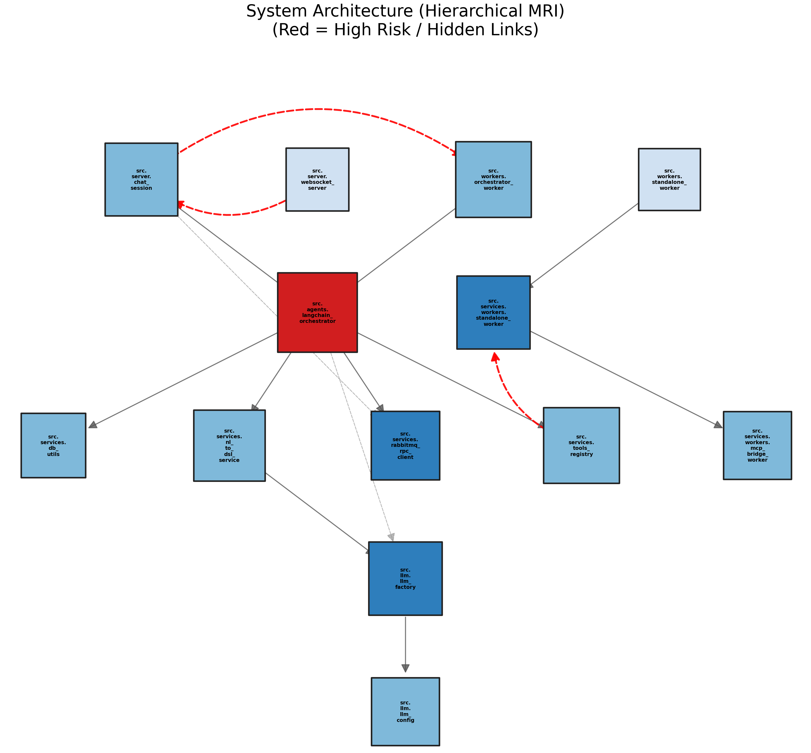
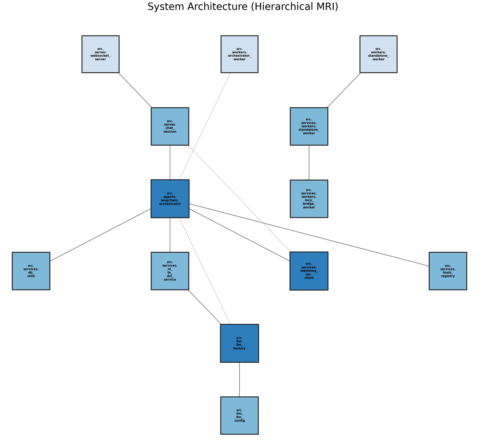

# 🗺️ Code Cartographer: The Architectural MRI for Python

> **Turn spaghetti code into clear, hierarchical maps. Detect hidden risks. Onboard faster.**


**Code Cartographer** is an intelligent MCP (Model Context Protocol) server that acts as a visual GPS for your codebase. 

Unlike standard dependency graphs, it combines **Static Analysis (AST)** with **Generative AI (Gemini-2.5-flash)** to reveal the "Shadow Architecture"—the implicit connections, technical debt, and risks that don't appear in explicit imports.

---

## 📸 See it in Action

### 1. Visualization: From Chaos to Order
The system enforces a **Hierarchical Top-Down Layout**, automatically breaking cyclic dependencies to create readable maps.

| 🔵 Structural View (Clean) | 🔴 Architectural MRI (Risks) |
|:---:|:---:|
| *Shows file structure & explicit imports* | *Shows Risk Heatmap & Hidden Links (DB/API)* |
|  |  |

### 2. AI-Powered Insights
It doesn't just draw; it understands. The AI detects **"Shadow Links"** (logical connections via Database tables, API routes, or Message Queues) and visualizes them as dashed red lines.



---

## ✨ Key Features

* **🕵️ Smart Repository Scanning:** * Parses Python AST to build a precise dependency graph.
    * Automatically handles imports and project structure.
* **🏥 Architectural MRI:**
    * **Risk Heatmap:** Identifies high-complexity modules and tightly coupled components (Red Nodes).
    * **Shadow Link Detection:** Finds implicit coupling (e.g., Service A writes to `users` table, Service B reads from it).
* **🎨 Intelligent Visualization:**
    * Generates high-res PNG maps.
    * Uses a smart "Skeleton Layout" algorithm to force a tree structure even in messy projects.
* **💾 Smart Storage & Caching:**
    * Centralized `StorageManager` indexes scans by project path.
    * Automatically cleans up old artifacts to save disk space.
    * Persists results so you don't re-run expensive AI analysis unnecessarily.
* **📚 Graph RAG Resources:** * Contextual lookups for LLMs (e.g., "Who depends on `auth_service`?").

---

## 📂 Project Structure

``` text
code-cartographer/
├── src/
│   ├── server.py                 # MCP entry point
│   ├── services/
│   │   ├── repository_scanner.py # AST scanning
│   │   ├── ai_analyzer.py        # Gemini integration
│   │   ├── graph_generator.py    # Graph rendering
│   │   └── storage_manager.py    # Persistence & cache
│   └── models/
│       └── schemas.py            # Pydantic schemas
├── mcp_storage/                  # Generated artifacts
└── requirements.txt
```

------------------------------------------------------------------------

## 🛠️ Installation & Setup

### Prerequisites

-   Python 3.10+
-   uv (pip install uv)
-   Google Gemini API Key
-   Claude Desktop

## 1️⃣ Clone & Install

``` bash
git clone https://github.com/RebeccaSimanTov/code-cartographer.git
cd code-cartographer
uv sync
```

## 2️⃣ Configure Environment

Create a `.env` file in the project root directory:

``` bash
GEMINI_API_KEY=your_google_api_key_here
```

------------------------------------------------------------------------

## 🛠️ Quick Test (MCP Inspector)

Want to test the tools **without setting up Claude**?\
Use the **MCP Inspector** --- an interactive web interface for running
tools and inspecting outputs.

``` bash
# Run the Inspector directly
npx @modelcontextprotocol/inspector uv run src/server.py
```

This will open a browser window where you can manually trigger tools
like\
`scan_repository` and view the JSON results.

------------------------------------------------------------------------

## 🔌 Connect to Claude Desktop

To integrate Code Cartographer into your AI workflow, edit the Claude
Desktop configuration file:

-   **Windows**\
    `%APPDATA%\Claude\claude_desktop_config.json`

-   **macOS**\
    `~/Library/Application Support/Claude/claude_desktop_config.json`

Add the following configuration\
(**update the path to match your local project location**):

``` json
{
  "mcpServers": {
    "code-cartographer": {
      "command": "uv",
      "args": [
        "run", "python",
        "C:/Path/To/code-cartographer/src/server.py"
      ]
    }
  }
}
```

------------------------------------------------------------------------

## 💡 Usage Guide

Once connected, simply talk to Claude to operate the tool:

| Goal              | Prompt Example                                                                 |
|-------------------|--------------------------------------------------------------------------------|
| Scan a Project    | `Please scan the repository at C:/Projects/MyLegacyApp.`                        |
| Visualize Structure | `Generate a quick map of the system.` *(Shows Blue / Structural Map)*          |
| Analyze Risks     | `Run an architectural MRI. Look for hidden risks and shadow links.`             |
| Visualize Risks   | `Show me the map again.` *(Shows Red / MRI Map)*                                |
| Deep Dive         | `What is the context of the billing_service module?`                            |
| Check Stats       | `Show me the architecture statistics.`                                          |
